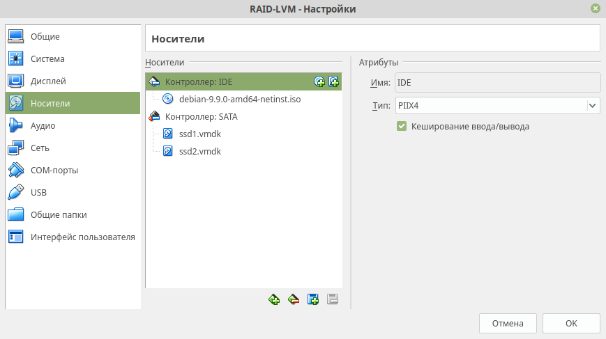
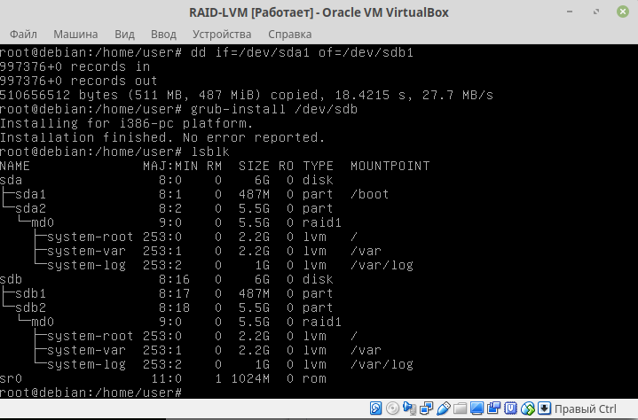
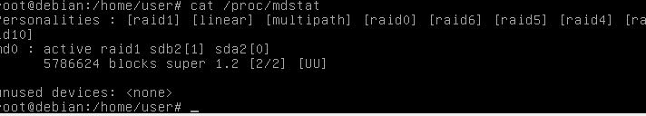
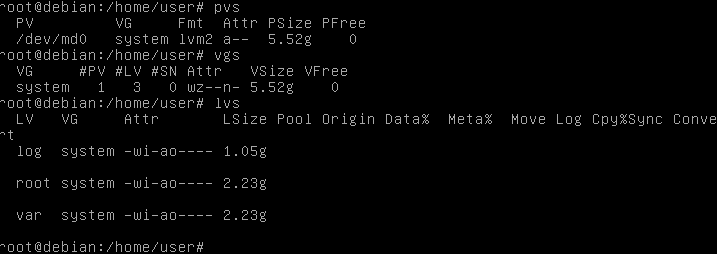
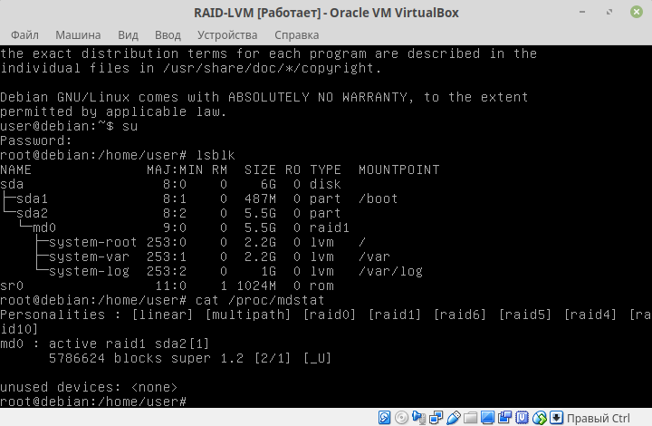
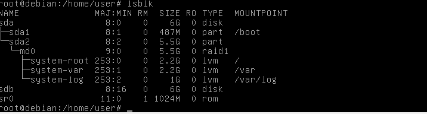
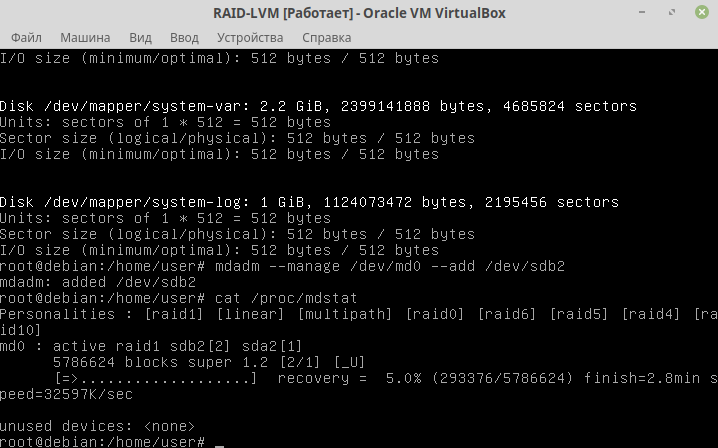

## Лабораторная работа №2 "RAID-LVM"
### Выполнил студент 2 курса Болдук Жецуня

![10] (screens/10.png)
![11] (screens/11.png)
![12] (screens/12.png)
![13] (screens/13.png)
![14] (screens/14.png)
![16] (screens/16.png)
![17] (screens/17.png)
![19] (screens/19.png)
![21] (screens/21.png)
![22] (screens/22.png)
![23] (screens/23.png)
![24] (screens/24.png)
![25] (screens/25.png)
![26] (screens/26.png)
![27] (screens/27.png)
![28] (screens/28.png)
![30] (screens/30.png)
![31] (screens/31.png)
![32] (screens/32.png)

